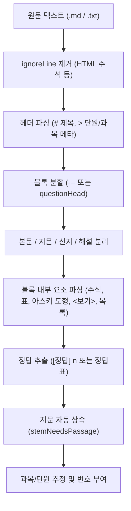

# booklet 파싱 요령 및 포맷 규격 가이드 (`format.md`)

이 문서는 booklet(문제 조판기)이 마크다운·텍스트 소스를 파싱하는 원리와 규격, 그리고 **경고 없이 깔끔하게 조판되기 위해 소스를 작성하는 핵심 요령**을 정리한 안내서입니다.

---

## 1. 파서 작동 원리 및 파이프라인

booklet 파서(`src/parser.js`)는 정규식(RegExp) 기반의 **줄 단위 1-pass 상태기계**로 동작합니다. 되돌아가기(backtracking) 없이 한 줄씩 읽으며, 다음과 같은 순서로 데이터를 구조화합니다.



### 포맷 자동 감지 (Auto Detection)
파일 탭에서 프로파일을 `자동(auto)`으로 두면 다음 3가지 내장 프로파일을 겨뤄 **가장 점수가 높은 것**을 자동으로 채택합니다:
- **우열 판정 기준**: `정상 선지(2개 이상)를 갖춘 문항 수 많은 쪽` > `경고 적은 쪽` > `총 문항 수 많은 쪽`
- `batch` 표지(`---`, `[문제]`, `[ref]`)가 있으면 `batch` 우선
- `mdheading` 표지(`### [문항 N]`)가 있으면 `mdheading` 우선
- 둘 다 없으면 마지막 구제책으로 `plain` 시도

---

## 2. 내장 포맷 프로파일 3종 규격

### (1) `batch` 프로파일 (가장 권장되는 표준 포맷)
`problem_generator`의 표준 산출물 형식으로, 가장 풍부한 구조화 기능을 지원합니다.

```markdown
# 2026학년도 화학Ⅰ 변형 문제 세트 — Batch 1
> 단원: Ⅰ-1. 기체의 성질
> 과목: 화학
> 풀이시간: 문항당 2분

---
[ref] 3쪽 [기체의 성질] 문제 10 Ⅰ-1. 기체의 성질
[문제]
1 (2분)
다음 글을 읽고 물음에 답하시오.

"""
기체 반응에서 온도와 압력이 일정할 때, 반응하는 기체와 생성되는 기체의 부피 사이에는
간단한 정수비가 성립한다(기체 반응의 법칙).
"""

그림은 강철 용기에 들어 있는 기체 A와 B의 상태를 나타낸 것이다.

```
       +-----------+       +-----------+
       |   A(g)    | 꼭지  |   B(g)    |
       |  2.0 atm  |--|X|--|  4.0 atm  |
       |    2 L    |       |    3 L    |
       +-----------+       +-----------+
```

이에 대한 설명으로 옳은 것만을 <보기>에서 있는 대로 고른 것은?

<보기>
ㄱ. 반응 전 전체 몰수는 16 mol이다.
ㄴ. 꼭지를 열었을 때 혼합 기체의 압력은 3.2 atm이다.
ㄷ. 분자량 비는 A : B = 1 : 2이다.

① ㄱ
② ㄴ
③ ㄱ, ㄷ
④ ㄴ, ㄷ
⑤ ㄱ, ㄴ, ㄷ
[해설]
[풀이]
1. 초기 PV 계산: A는 2 * 2 = 4, B는 4 * 3 = 12. 총 PV = 16.
2. 꼭지 개방 후 부피 = 2 + 3 = 5 L이므로 혼합 압력 = 16 / 5 = 3.2 atm.
[팁]
온도가 일정할 때 PV 곱을 자연수 몰수로 치환하면 연산 속도가 빨라집니다.
[정답] 5
```

---

### (2) `mdheading` 프로파일 (마크다운 헤딩형)
마크다운 서식(`### [문항 N]`, 펜스 지문, 파일 끝 정답표)으로 작성된 세트입니다.

```markdown
# 국어 문법 모의고사
- 영역: 국어 문법 — 단어(형태론)

---

### [문항 1] 품사 통용 판정
- **풀이 권장 시간**: 2분

다음 글을 읽고 <보기>의 문장을 탐구하시오.

```text
[지문]
국어에서 동일한 형태의 단어가 문맥에 따라 서로 다른 품사로 쓰이는 것을
품사 통용이라 부른다.
```

<보기>
> ㄱ. 대궐 만큼 큰 집을 지었다.
> ㄴ. 노력한 만큼 결실을 맺는다.

① ㄱ의 '만큼'은 보조사이다.
② ㄴ의 '만큼'은 의존명사이다.
③ ㄱ, ㄴ 모두 조사이다.
④ ㄱ, ㄴ 모두 의존명사이다.
⑤ 둘 다 해당하지 않는다.

---

## [정답 및 정밀 해설]

### [문항 1 정답]: ①
- **정답 해설**: 체언 뒤의 '만큼'은 보조사이므로 앞말에 붙여 씁니다.
```

- **특징**:
  - 문항 머리 줄 아래 `- **풀이 권장 시간**: 2분` 메타 인식
  - 인용 부호(`> `)는 `quotePrefix`에 의해 자동 제거
  - ```` ```text ```` 블록의 첫 줄이 `[지문]`이면 지문으로 파싱
  - 파일 끝 `## [정답 및 정밀 해설]` 아래 `### [문항 N 정답]: n`을 각 문항의 번호와 매핑

---

### (3) `plain` 프로파일 (일반 텍스트/시험지형)
`---` 블록 구분선 없이 `1.` 또는 `문제 1`로 문항이 나뉘는 일반 텍스트입니다.

```markdown
문제 1 (2분)
다음 중 이차방정식 $x^2 - 4x + 3 = 0$의 해로 옳은 것은?

① x = 1 또는 x = 3
② x = -1 또는 x = -3
③ x = 2 또는 x = 3
④ x = 1 또는 x = 2
⑤ 해가 없다

[해설]
인수분해하면 $(x - 1)(x - 3) = 0$이다.
[정답] 1

문제 2
함수 $f(x) = 2x + 1$에 대하여 $f(3)$의 값은?
...
```

---

## 3. 무결점 파싱을 위한 핵심 작성 요령 (Checklist)

### ① 블록 구분 (`---`)
- `batch` 및 `mdheading`에서는 **반드시 문항과 문항 사이를 `---` 단독 줄로 구분**해야 합니다.
- `---` 앞뒤에 불필요한 공백 문자가 없어야 합니다 (`^---\s*$` 규칙).

### ② 문항 번호와 권장 시간
- `[문제]` 바로 다음 줄에 `번호 (풀이시간)` 형태로 적습니다:
  - 올바른 예: `1 (2분)`, `문제 1 (2분)`, `01. (3분)`, `1.`
  - 잘못된 예: `1번 문제 2분` (정규식이 번호와 시간을 인식하지 못함)

### ③ 지문(Passage) 작성 요령
- **열고 닫기**: `"""`는 반드시 단독 줄에서 열고 닫아야 합니다.
  ```markdown
  """
  지문 본문 내용...
  줄바꿈도 자유롭게 유지됩니다.
  """
  ```
  닫는 `"""`를 빠뜨리면 `"지문이 닫히지 않았습니다"` 경고가 발생합니다.
- **1지문 다문항 세트 (지문 자동 계승)**:
  - 1번 문항에 `"""`로 지문을 넣고, 2번·3번 문항에는 지문을 생략합니다.
  - 2번·3번 문항 발문 첫머리에 아래 표기 중 하나가 들어가면 앞선 지문을 자동으로 물려받습니다:
    - `윗글`, `위 글`, `위 시`, `앞의 글`
    - `(가)`, `(나)`, `[A]`, `㉠`, `ⓐ`
    - `'작은따옴표 인용 어구'`
  - 지문 없는 문항이 지문 묶음으로 묶이면 조판 시 `[1~3] 다음 글을 읽고 물음에 답하시오.`가 자동으로 생성됩니다.

### ④ `<보기>` 및 자료 상자(Box)
- 박스 시작: `<보기>`, `<보기 1>`, `<자료>`, `<표>`, `<조건>`, `<그림>`, `<대화>`, `<사례>`
- 박스 내부 항목 기호:
  - 한글 자음: `ㄱ.`, `ㄴ.`, `ㄷ.`, `ㄹ.`
  - 괄호: `(가)`, `(나)`, `(다)`
  - 알파벳/숫자: `a.`, `b.`, `1.`, `2.`
- 4칸 이상 들여쓴 줄(`    문장`)은 자동으로 "삽입 문장(`inserted`)"으로 인식되어 시각적으로 강조됩니다.

### ⑤ 선지(Choices) 작성 요령 (가장 중요!)
- **선지 기호**: 줄 첫머리에 반드시 원문자(`①`~`⑤`)를 씁니다.
  - 4개 미만이면 `"선지가 n개뿐입니다"` 경고 발생
  - 선지를 전혀 못 찾으면 `"선지를 찾지 못했습니다"` 경고 발생
- **선지 위치**: **반드시 문제의 맨 마지막(해설 직전)에 와야 합니다.**
  - 선지 뒤에 설명 줄이나 발문이 남아 있으면:
    `"선지 뒤에 남은 줄 n개를 자료로 붙였습니다 — 선지 앞으로 옮기세요"` 경고가 발생합니다.
- **긴 선지의 줄바꿈**:
  - 선지 내용이 길어 줄을 바꿀 때는 다음 줄을 **2칸 이상 들여쓰기**해야 같은 선지로 이어집니다.
- **한 줄 나열 선지**:
  - `① ㄱ   ② ㄴ   ③ ㄱ, ㄴ   ④ ㄴ, ㄷ   ⑤ ㄱ, ㄴ, ㄷ` 처럼 한 줄에 적어도 정상 인식됩니다.

### ⑥ 수식 및 아스키 아트(도형)
- **블록 수식**: `$$` 단독 줄로 열고 닫거나, `$$ E = mc^2 $$`처럼 한 줄에 작성합니다.
- **인라인 수식**: `$x + y = z$` 형태로 작성합니다. (수식 내부 텍스트는 인라인 정규식 치환에서 안전하게 보호됩니다.)
- **아스키 아트 / 실험 장치 그림**:
  ````markdown
  ```
  +-----------+       +-----------+
  |   A(g)    | 꼭지a |   B(g)    |
  +-----------+       +-----------+
  ```
  ````
  펜스(` ``` `)로 감싸면 줄바꿈과 고정폭 글꼴이 보존되며 아스키 도형으로 조판됩니다.
- **표 (Table)**: 마크다운 파이프 표(`| 헤더 |`, `|---|`)를 지원합니다.

### ⑦ 해설 및 정답
- 해설은 `[해설]` 줄로 시작합니다.
- 정답은 반드시 `[정답] 5` 또는 `[정답] ⑤` 형태로 적습니다.
  - 정답이 빠지면 `"해설은 있는데 [정답]을 찾지 못했습니다"` 경고 발생
  - 복수 정답인 경우 `[정답] 1, 3` 또는 `[정답] ①, ③`으로 쉼표 구분 가능
- 해설 내부 섹션은 대괄호(`[풀이]`, `[팁]`, `[오답 피하기]`, `[지문 요약]`)로 나누면 깔끔하게 구분되어 조판됩니다.

---

## 4. 자주 발생하는 파싱 경고와 해결법

| 경고 문구 | 원인 | 해결 방법 |
|---|---|---|
| `선지를 찾지 못했습니다` | 줄 첫머리에 `①`~`⑤` 선지 기호가 없음 | 각 선지 줄 시작을 `① `로 시작하도록 수정 |
| `선지 뒤에 남은 줄 n개를 자료로 붙였습니다` | 선지(`①`~`⑤`) 아래에 문제 본문이나 `<보기>`가 위치함 | 해당 내용을 선지 위쪽(발문 영역)으로 이동 |
| `지문이 닫히지 않았습니다` | `"""`로 지문을 열고 닫는 `"""`를 누락함 | 지문 끝에 닫는 `"""` 추가 |
| `해설은 있는데 [정답]을 찾지 못했습니다` | `[해설]`은 있으나 `[정답] n` 라인이 없음 | 해설 끝 또는 시작에 `[정답] 3` 명시 |
| `문항으로 읽을 수 없어 건너뜁니다` | 구분선(`---`)은 있으나 문항 번호나 선지가 없음 | 파일 머리말 뒤 첫 문항 앞에 `---`와 `[문제]`가 있는지 확인 |
| `지문 계승 대상이 없습니다` | 발문에 `윗글`이 있으나 앞선 문항에 지문이 없음 | 세트의 첫 번째 문항에 지문(`"""`)이 존재하는지 확인 |

---

## 5. 인라인 서식 및 특수 규칙

booklet은 파싱 완료 후 다음 태그와 기호를 자동 변환합니다:
- **허용 HTML 태그**: `<u>`, `<b>`, `<i>`, `<em>`, `<strong>`, `<sub>`, `<sup>`, `<s>`, `<mark>`, `<br>`
  - 원문에 `<u>밑줄</u>`을 쓰면 인쇄본에서도 밑줄이 그대로 유지됩니다.
- **마크다운 볼드**: `**강조**`는 `<b>강조</b>`로 자동 변환됩니다.
- **작은따옴표 어구 (국어)**: 선지 안의 `'어구'`는 자동으로 굵은 글씨(`<b>'어구'</b>`)로 표시됩니다.
- **기호 배지화**: `㉠`~`㉭`, `ⓐ`~`ⓔ`, `[A]`~`[E]`는 조판 시 깔끔한 인라인 배지 태그로 감싸집니다.

---

## 6. 파일 메타데이터 및 단원 자동 인식 요령

파일 최상단(첫 번째 `---` 이전)에 아래 메타데이터를 기재하면 문서 정보와 단원이 자동 설정됩니다:

```markdown
# 2026학년도 수능 대비 화학Ⅰ 문제집
> 단원: Ⅰ. 기체의 성질 — 01 기체 반응 법칙
> 과목: 화학
> 학년: 고2
> 회차: 1
```

- **단원 추출 규칙**:
  - `대단원 — 소단원` (엠대시 `—` 기준 분할)
  - `Ⅰ. 기체의 성질` 등 번호 패턴 뒤에서 자동 분할
  - `[ref]` 줄의 `[단원명]`도 단원 추정에 활용됩니다.
